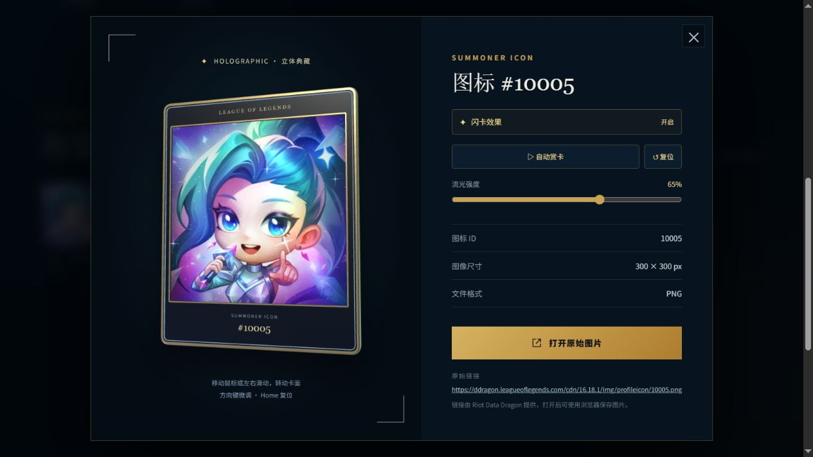
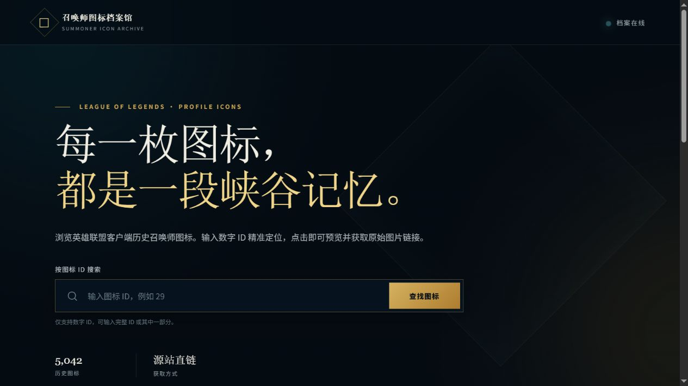
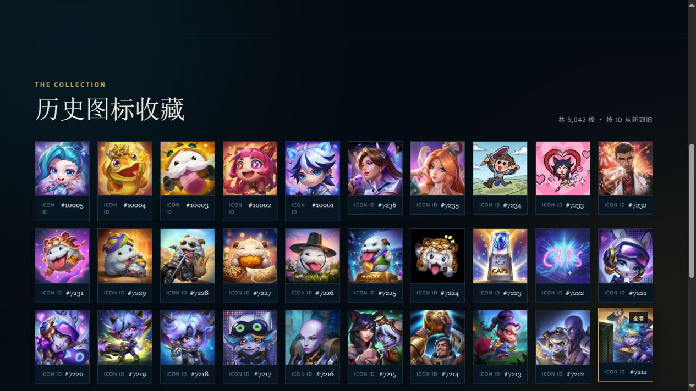

# 召唤师图标档案馆

一个无需后端的英雄联盟历史召唤师图标浏览站。支持图标 ID 搜索、每页 50 个、原图预览与源站链接。

支持全息闪卡效果：列表悬停显示镭射流光，大图使用 Three.js 实时渲染有厚度、金属卡边和凹入图面的 3D 卡片。镭射随观看角度变化，表面闪点独立闪烁；打开时自动赏卡，移动鼠标或左右滑动可手动转动。聚焦卡片后也可用方向键调整、Home 复位。

「闪卡效果」开关和「流光强度」滑块同时控制列表与大图，关闭后查看原图颜色；「自动赏卡」控制卡片自动转动。系统开启减少动态效果时停止自动旋转与闪烁，关闭弹窗或隐藏页面后停止绘制。Three.js 固定版本随项目提供，无需安装依赖或运行构建命令。

所有图标直接复用原始 PNG，更新数据后新图标自动获得相同效果。卡框、图面和反光膜位于不同深度；现有素材没有人物与背景分层，因此不会把人物单独抠出或伪造人物浮动。源站链接仍提供未经特效处理的原始图片。

## 在线预览

[lol-avatar.981127.xyz](https://lol-avatar.981127.xyz/)

### 全息闪卡效果

点击图标进入大图预览，移动鼠标即可观察随角度变化的镭射反光与闪点。下图为实际页面截图，静态图片仅展示一个观看角度。



### 页面与图标列表





## 本地运行

要体验完整 3D 效果，请使用任意静态文件服务器：

```powershell
python -m http.server 4173
```

然后访问 `http://localhost:4173`。

直接打开 `index.html`、浏览器不支持 WebGL 或 3D 资源加载失败时，仍可使用 CSS 闪卡预览与原图浏览。

## 检查

```powershell
node --test tests/holo-preview.test.mjs
```

覆盖快速切换、关闭期间加载完成、过期请求失败、贴图资源释放，以及减少动态效果与停止绘制。

## 更新图标索引

```powershell
node scripts/sync-icons.mjs
```

图标索引和原始 PNG 来自 [Riot Data Dragon](https://developer.riotgames.com/docs/lol#data-dragon)。网站不需要 Riot API Key。

## 参考与致谢

感谢 [EverettFish](https://github.com/EverettFish) 及 [Holo Card Studio](https://github.com/EverettFish/holo-card-studio) 的贡献者开源分享全息闪卡的实现思路。本项目参考了[涂山之约交互示例](https://card.waterq.us/cards/tushan-date-002/)，并基于其公开着色器中的噪声、色彩混合和视角镭射公式进行适配，使用 Three.js 为现有召唤师图标渲染立体卡片。

想了解分层视差、Three.js 着色器及 Blender 卡片制作流程，可访问 [Holo Card Studio 原仓库](https://github.com/EverettFish/holo-card-studio) 和[浏览器端参考实现](https://github.com/EverettFish/holo-card-studio/blob/main/assets/web-template/app.js)。

第三方代码的来源与 MIT 许可见 [THIRD_PARTY_NOTICES.md](THIRD_PARTY_NOTICES.md)。
